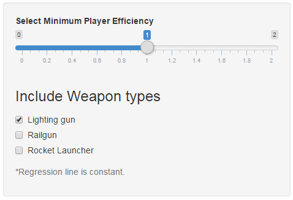
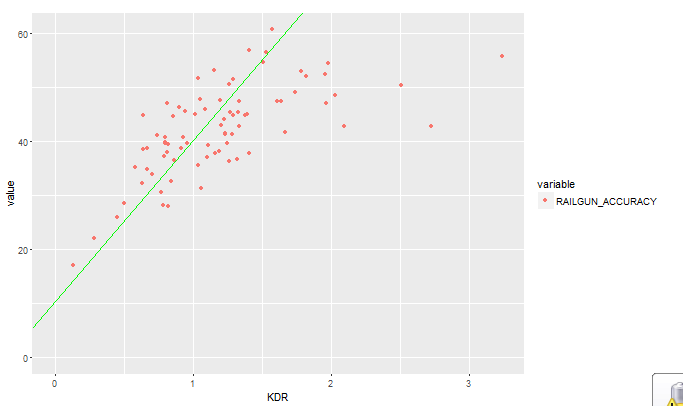

Linking Quake Player Efficiency to Aim Accuracy
========================================================

author: staszz2

date: Nov. 25, 2016

1. General Description
========================================================
Background - Quake is an online game where players battle eatchother with various weapons. Stats are extracted through QuakeLive API JSON and stored for simplicity in post-processed CSV file.

This application is meant to explore the following things:

- Relationship between efficiency and weapon aim
- General regression pattern and role of weapons
- How far does an aim take a person and aim-alone stops working

2. Basic data
========================================================


Head of used players data looks like this:
<font size="4">

```r
head(dataSet, 10)
```

```
              Name LIGHTNING_ACCURACY ROCKET_ACCURACY RAILGUN_ACCURACY
1           boxnet           15.68437        29.65919         17.08163
2  TheGreen3astard           15.18075        28.05355         22.13889
3   CluckyInventor           18.13765        18.28414         26.04369
4            Mundo           19.28518        28.47012         28.63092
5           writhe           24.66522        28.61507         35.18031
6          mouwgli           17.90541        28.29735         32.20683
7        Dishwasha           19.41748        41.08153         38.52171
8             bo0m           34.52193        36.72895         44.85662
9           bwnage           21.21960        41.16678         34.89362
10     alexmeister           23.82100        34.87902         38.70273
         KDR
1  0.1336634
2  0.2812721
3  0.4514388
4  0.5000000
5  0.5773810
6  0.6344648
7  0.6378378
8  0.6388262
9  0.6650246
10 0.6655949
```
</font> 

3. Usage
========================================================
1. Select weapons you want to explore
2. Slide the eficiency slider to see how aim values change
3. Find points where aim no-longer follows general regression



4. Results
========================================================
1. At lower efficiencies all you need is to improve your aim
2. At about 1.4 KDR (efficiency) aim is no longer main contributing factor
3. Explore different weapons



5. Application and links
========================================================
* Shiny app - https://staszz2.shinyapps.io/QuakePlayers/
* My github - https://github.com/staszz2
* Quake live in action - https://www.youtube.com/watch?v=sfwG1zgc0_Q

Thank you!

